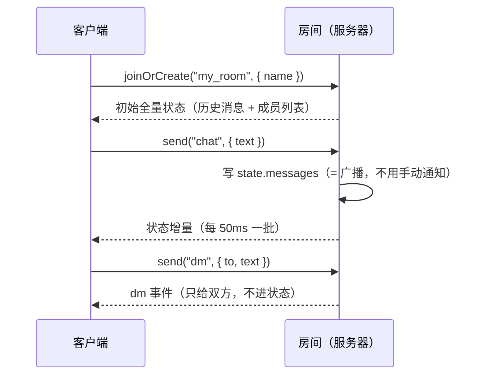

# 新人阅读指南：这个项目在教你什么

> **目标读者**：会 TypeScript、用过一点前端框架，但**没碰过 Colyseus** 的人。
> 如果你正打算把自己的 Web 游戏迁过来，直接看 **[§4 迁移差量表](#4-从聊天室到你的游戏缺什么加在哪)** ——
> 它会告诉你"聊天室这套写法用到的东西，游戏里还缺哪几块、每一块该加在哪个文件"。
>
> 本文不重复协议细节（看 [`protocol.md`](protocol.md)）和设计取舍（看 [`architecture.md`](architecture.md)），
> 只回答一件事：**代码按什么顺序读、每一处到底在讲哪个概念。**

## 0. 三条阅读路线

| 你的目的           | 建议读法                                                                |
| ------------------ | ----------------------------------------------------------------------- |
| 只想跑起来看看效果 | §1 → §2 的「第 0 站」                                                   |
| 要接手改这个项目   | §1 → §2 全读（每站末尾自测题答得上来再往下）→ §3 速查表                 |
| 要把游戏迁过来     | §1 → §2 重点第 3/4/5 站 → **§4 迁移差量表** → §5 三个练习（练关键 API） |

每站末尾的「自测问题」不是复习题，是**验收标准**：答不上来就说明那一段还没读进去，回头再看一眼。

---

## 1. 先建立三个概念，再看代码

Colyseus 的心智模型只有三样东西，这个项目里正好各有对应文件：

| 概念             | 人话解释                                                                                              | 本项目对应                                 |
| ---------------- | ----------------------------------------------------------------------------------------------------- | ------------------------------------------ |
| **房间 Room**    | 服务器进程里的一个对象，可以被多个客户端加入的"会话/对局"。客户端 `joinOrCreate` 后跟它建立 WebSocket | `server/src/rooms/MyRoom.ts`               |
| **状态 State**   | 挂在房间上的一份数据。你改它，框架**自动把增量同步给房间里所有人**（默认 20 次/秒 = 每 50ms 一批）    | `server/src/rooms/schema/MyRoomState.ts`   |
| **消息 Message** | 一次性事件：可以只发给一个人（`client.send`），也可以广播（`broadcast`）。**不改状态**，只是通知      | `shared/zodSchemas.ts` + `MyRoom.messages` |

**最该记住的一句话**：

> 状态是「**广播给全房间、会累积、后加入的人一次性收到全量**」的；
> 消息是「**一次性、可以只给一个人**」的。

后面所有设计都是这句话的推论。比如：公共聊天记录走**状态**（后进来的人能直接看到历史），
私聊走**消息**（状态是广播的，写进去等于群发）。见 `MyRoom.messages.chat` 与 `MyRoom.messages.dm`。



---

## 2. 阅读路线（7 站）

### 第 0 站：先跑起来

```bash
bun install
bun run dev      # 一键起三个进程：shared 编译监听 + server(2567) + client(5173)
```

打开 `http://localhost:5173`，开两个标签页各起一个昵称，互相发消息、点对方名字私聊。
**先有体感再读代码**：你会知道"状态同步"到底是什么速度、"私聊"在界面上是什么样子。

顺手记两个调试入口（只在开发环境）：

- `http://localhost:2567/` —— Colyseus Playground（不用写前端就能连房间、看状态快照）；
- `http://localhost:2567/monitor` —— 监控面板（房间列表、连接数）。

> 这两个入口是 `server/src/app.config.ts` 里 `NODE_ENV !== "production"` 时才挂的 —— 读完第 2 站你会明白为什么。

### 第 1 站：`shared/zodSchemas.ts` —— 协议的唯一真源

**先读**：`ChatPayloadSchema`、`JoinOptionsSchema`、`PrivateChatPayloadSchema`、`MAX_MESSAGE_LENGTH`。

**带着这个问题读**：为什么要把校验规则单独抽一个包？

- `server` 和 `client` 都通过包名 `@colyseus-chat/shared` import 它，所以**两边对"什么算合法消息"的理解永远一致**：
  客户端用它拦下空白/超长，服务端用同一套配方再校验一遍。
- 服务端**永远不信任客户端**：即使客户端拦过了，服务端也要独立校验（见第 4 站）。
- 它是**编译过**的包（`shared/dist`）：改完源码要重新构建，`bun run dev` 里有一个 `tsc --watch` 专门干这个。
  单独跑某个子包时，`prestart` / `prebuild` / `precheck` 会自动先编译一次。

**自测**：把 `MAX_MESSAGE_LENGTH` 从 500 改成 10，需要动几个文件？为什么？

### 第 2 站：`server/src/index.ts` + `app.config.ts` —— 服务器入口

**先读**：`index.ts`（就一行 `listen(app)`）→ `app.config.ts` 的 `defineServer({ rooms, routes, express })`。

- `rooms: { my_room: defineRoom(MyRoom) }`：**房间名 `my_room` 就是客户端 `joinOrCreate("my_room")` 的那个字符串**，
  两边必须一致（客户端里是常量 `ROOM_NAME`）。
- `express` 里挂了 `express.static(client/dist)`：线上**前后端同源**，页面和 WebSocket 都由 Colyseus 这同一个服务提供
  —— 所以没有跨域、没有单独的静态服务器。这就是为什么生产环境客户端连服务器**不用配地址**（见第 5 站）。
- `playground()` / `monitor()` 只在非生产环境挂载。

**自测**：如果客户端把房间名写成 `chat`，会发生什么？（提示：不是"连不上服务器"，而是匹配不到房间）

### 第 3 站：`server/src/rooms/schema/MyRoomState.ts` —— 状态长什么样

**先读**：`ChatMessage`、`MyRoomState` 两个 `schema({...})`。

- `t.array(ChatMessage)`：聊天记录，**有序数组**，追加在后、超出 50 条从头部丢；
- `t.map("string")`：成员列表，`sessionId -> 昵称`。用 map 不用数组，是因为"有人离开"要按 `sessionId`
  直接删；用数组就得自己维护下标。

**这一站要建立的关键认知**：`state` 不是"服务器上的一份普通数据"，而是**"改了它就等于广播"**。
所以你**永远不会**在代码里看到"把消息发给所有人"的循环 —— 写进 `state.messages`，框架自己会发。

**自测**：为什么消息字段里要存 `sessionId` 而不是只存昵称？（提示：客户端要判断"哪条是我发的"）

### 第 4 站：`server/src/rooms/MyRoom.ts` —— 房间逻辑（**本项目的主菜**）

**先读**：类的字段（`maxClients`、`state`、`messages`）→ 四个生命周期 → 两个消息处理器。

1. **生命周期**：`onCreate`（房间创建，一般在这里读 `options`、注册事件、启动循环）
   → `onJoin`（有人进来，这里把昵称写进 `state.members`）
   → `onLeave`（有人离开/掉线，这里删成员）
   → `onDispose`（房间销毁，所有人走光后自动触发）。
2. **`messages = { chat, dm }`**：声明式的消息处理器（另一种写法是 `onCreate` 里 `this.onMessage("chat", cb)`，
   那种写法会返回一个解绑函数，适合动态注册）。客户端 `room.send("chat", ...)` 就会走到这里。
3. **两条投递路径的对照**（本项目的教学重点）：
   - `chat`：校验 → `state.messages.push(...)` → **框架自动同步给所有人**（连后加入者的历史都有）；
   - `dm`：校验 → `this.clients.get(to)` 找到收件人 → `target.send("dm", ...)` + `client.send("dm", ...)` 回执
     → **一行都不进 state**，因为状态是广播的，私聊进去就等于群发。代价是没有历史（见 `protocol.md` §3.6）。
4. **校验策略**：两个处理器都是 `safeParse` + 丢弃 + `console.warn`，**不踢人**。
   注意注释里那句"刻意不用 Colyseus 自带的 `validate()`"：那个包装器校验失败会 `client.leave(CloseCode.WITH_ERROR)`
   —— 一句话超长就掉线，对聊天室太重了。**这是"框架给的默认行为不一定适合你"的第一个例子。**
5. **`from` / `fromName` 一律由服务端填写**：客户端传什么都不作数，所以没法冒名。

**自测**：把 `dm` 改成写进 `state.messages`（只改一行），界面上会出现什么现象？为什么？

### 第 5 站：`client/src/App.svelte` —— 客户端只是"状态的影子"

**先读**：`join()` → `send()` → `$effect` 滚动 → 模板里的 `members` / `shownMessages`。

- `client.joinOrCreate(ROOM_NAME, { name })` → 拿到 `room`；`room.sessionId` 就是服务端认的"你"。
- **订阅状态**：`getStateCallbacks(room)` 之后 `state.messages.onAdd(cb, true)`：
  第二个参数 `immediate=true` 表示"**先把已有的补一遍**"，之后每条新消息走同一个回调
  —— 历史和新消息是同一套代码，这也是"状态"相对"事件"的好处。成员列表同理，另有 `onRemove`。
- **发消息**：`room.send("chat", parsed.data)` / `room.send("dm", { to, text })`，发送前用共享配方本地校验。
- **状态是只读的**：客户端永远不直接改 `room.state`（改了也会被下一次增量覆盖）。所有变更都从服务端来。
- `$state.raw` 存 `room`：第三方类实例（Colyseus 的 Room）被 Svelte 的深层代理包一层会出兼容/性能问题。
- **私聊的界面**：点成员标签 → `activePeerId` 变化 → `shownMessages` 这个 `$derived` 换数据源，
  消息列表本身不变；收到的 `dm` 事件先看 `from` 是不是自己，来定"对方"是谁（一条私聊双方都会收到）。
- **断线**：`room.onLeave` 里把界面退回加入页并提示 —— 真实项目里这里通常换成"尝试重连"（见 §4）。

**自测**：`onAdd(cb, true)` 的 `true` 去掉以后，刷新页面会看到什么区别？

### 第 6 站：`server/test/MyRoom.test.ts` —— 怎么证明它真的对

- 用 `@colyseus/testing` 的 `boot(appConfig)` 起**真实服务器**，用**真实 SDK 客户端**连接 ——
  不是 mock，所以能测出协议层的真实行为。
- 关键手法 `waitForNextPatch()`：**先挂上等待、再动作**，避免竞态（测试里到处都是这个顺序）。
- 消息类断言用 `Promise.withResolvers()` 等一条指定事件；否定断言（"第三方收不到"）用"水位线"技巧：
  发一条公共消息并等它的 patch 回来，此时前面的消息一定已经处理过了。

**自测**：为什么"第三方收不到私聊"这条断言不能只写 `assert(carolInbox.length === 0)` 就结束？
（提示：得先保证服务端**确实处理过**那条私聊，否则断言永远成立）

### 第 7 站（可选）：`scripts/dev.mjs` / `scripts/release.mjs` / `Dockerfile` / `deploy/`

代码怎么被跑起来和送上线的：本机 `bun run release` 构建 → 只传几百 KB 产物 → 主机装配镜像重启容器。
同源部署（nginx 只做 TLS + 反代）让整件事简单很多，细节见 [`docs/architecture.md`](docs/architecture.md) §6 与
[`deploy/README.md`](deploy/README.md)。**这一站可以最后看**，不影响理解框架。

---

## 3. 概念 ↔ 代码 速查表

| Colyseus 概念                                         | 一句话解释                                                        | 本项目位置 / 是否用到              |
| ----------------------------------------------------- | ----------------------------------------------------------------- | ---------------------------------- |
| `joinOrCreate(name, options)`                         | 房间不存在就建、存在就加入（还有 `create` / `join` / `joinById`） | `App.svelte` 的 `join()` ✅        |
| `sessionId`                                           | 单次连接的 ID，**不掉线不变、重连会变**                           | 到处都在用 ✅                      |
| `onCreate / onJoin / onLeave / onDispose`             | 房间生命周期四件套                                                | `MyRoom` ✅                        |
| `onAuth(client, options, context)`                    | 加入**之前**的鉴权，可拒绝连接（游戏里用来验 token）              | ❌ 没做（见 `architecture.md` §8） |
| `state`（`schema({...})` / `t.array` / `t.map`）      | 同步状态；改它 = 广播                                             | `MyRoomState` ✅                   |
| `maxClients`                                          | 房间人数上限，默认 `Infinity`；满了自动锁定                       | 本项目 = 4 ✅                      |
| `patchRate`（默认 50ms）                              | 状态增量的发送频率 —— **状态同步不是每帧**                        | 用默认值 ✅                        |
| `this.clients.get(sessionId)`                         | O(1) 按 sessionId 找连接（`getById` 已废弃）                      | `dm` 处理器 ✅                     |
| `client.send(type, payload)` / `this.broadcast(...)`  | 点对点 / 广播事件                                                 | `dm` ✅ / 广播用状态代替 ✅        |
| `this.onMessage(type, cb)`                            | 命令式注册消息处理器（返回解绑函数）                              | 用了声明式 `messages = {}` ✅      |
| `setTimestep(cb, ms)`                                 | 游戏循环，默认 16.6ms；收到的是**测得**的 dt                      | ❌ 聊天室不需要                    |
| `setFixedTimestep(step, tickRate, opts)`              | **固定步长**循环，累加器保证每步 `dt` 相同（预测/回滚的前提）     | ❌ 游戏必备                        |
| `defineInput(Schema)` + `this.inputs.get(sid)`        | 按客户端缓冲的输入流，tick 里逐条消费                             | ❌ 游戏必备                        |
| `this.clock`                                          | 房间级定时器（冷却、倒计时）                                      | ❌ 没用                            |
| `allowReconnection(client, seconds)`                  | 在 `onLeave` 里允许掉线者重连；客户端 `client.reconnect(token)`   | ❌ 见 §4                           |
| `autoDispose`（默认 `true`）                          | 最后一个人走光后销毁房间；游戏对战房间常需要设 `false`            | 用默认值 ✅                        |
| `lock() / unlock()`                                   | 手动封房（比赛开始后禁止新加入）                                  | ❌                                 |
| `allowRewindState()`                                  | 服务端延迟补偿：记录位置历史，按客户端"看到的时间"回滚            | ❌ 进阶                            |
| `@unreliable` 字段 + `unreliablePatchRate`            | 高频且可丢的状态（位置）走不可靠通道                              | ❌ 进阶                            |
| `Predict` / `Reconciler` / `SimReconciler`            | **客户端**预测与和解（同一份模拟代码两端跑）                      | ❌ 进阶                            |
| `getStateCallbacks(room)` → `state.x.onAdd(cb, true)` | 客户端订阅状态增量，`true` = 先补一遍当前值                       | `App.svelte` ✅                    |

> 版本提醒：这个仓库用的是 Colyseus **0.18**。老教程里的 `setSimulationInterval` 在本版本**已重命名为
> `setTimestep`**（旧名还能用，标了 deprecated）；`0.18` 还带了输入缓冲、固定步长、服务端回滚和客户端预测这一整套
> —— 迁移游戏时值得直接按新 API 写，别照抄旧博客。

---

## 4. 从聊天室到你的游戏：缺什么、加在哪

聊天室只用了框架的"状态同步 + 消息"两件事。做一个实时游戏，要补的东西按**建议落地顺序**排：

| 能力                     | 框架里的做法（0.18）                                                                                                     | 本项目现状                      | 你该在哪下手                                         |
| ------------------------ | ------------------------------------------------------------------------------------------------------------------------ | ------------------------------- | ---------------------------------------------------- |
| ① 服务器权威的游戏循环   | `onCreate` 里 `this.setTimestep((dt) => { ... })`（默认 60Hz）；要确定性就 `setFixedTimestep(step, 30)`                  | 只有事件驱动，无循环            | `MyRoom.onCreate`                                    |
| ② 玩家实体               | 每个玩家一个子 schema：`players: t.map(Player)`（可 `t.array`，看你要不要按 id 删）                                      | 只有 `members: t.map("string")` | `MyRoomState` 加 `Player`，`onJoin` 建、`onLeave` 删 |
| ③ 输入                   | 客户端 `room.send("input", ...)`；0.18 更推荐 `defineInput` + `this.inputs.get(sid)` 在 tick 里消费                      | 无（聊天不需要）                | `MyRoom`：`inputs = this.defineInput(...)`           |
| ④ 客户端平滑（**必做**） | 收到的状态是 20Hz 的，渲染是 60Hz：位置做**插值**（朝最新值 lerp），否则画面一顿一顿                                     | 无（聊天消息不用平滑）          | `App.svelte`（或你的渲染层）                         |
| ⑤ 客户端预测 + 回滚      | 本地先跑自己的输入、服务器确认后重放：客户端 `Predict` / `Reconciler`；服务端 `setFixedTimestep` + 输入序号              | 无                              | 有了 ①②③④ 之后再加                                   |
| ⑥ 延迟补偿 / 命中判定    | 服务端 `this.allowRewindState()` + `rewind.attachAll(collection, { fields })`                                            | 无                              | 射击/瞬发技能类玩法才需要                            |
| ⑦ 断线重连               | 服务端 `onLeave` 里 `this.allowReconnection(client, 15)`；客户端存 `room.reconnectionToken` 后 `client.reconnect(token)` | 直接退回加入页                  | `MyRoom.onLeave` + `App.svelte` 的 `onLeave`         |
| ⑧ 分房 / 匹配            | `defineRoom(Room, ...)` 注册多个房间类型，`joinOrCreate(name, options)` 带自定义 options 做匹配                          | 单房间 `my_room`                | `app.config.ts` + 客户端房间名                       |
| ⑨ 加入前鉴权             | `Room.onAuth(client, options, context)`：验 token，return 假值/抛错即拒绝                                                | 只收昵称，没有鉴权              | `MyRoom.onAuth`（配合 ⑧）                            |
| ⑩ 反作弊 / 服务端权威    | 一切以服务端为准：客户端只发**意图**，服务器决定结果（本项目的 `dm` 校验就是这个思路的雏形）                             | ✅ 已有校验习惯                 | 全局原则                                             |
| ⑪ 带宽 / 状态瘦身        | 只把"别人也需要的、会持续变化的数据"放进 state；窄类型（`t.uint8`）、高频位置用 `@unreliable`                            | ✅ 状态很小                     | `MyRoomState` 字段设计                               |
| ⑫ 持久化 / 排行榜        | **框架不管**：自己接数据库或缓存，通常在 `onDispose` 结算、`onAuth` 读档                                                 | ❌ 无                           | 你的业务层                                           |

**落地顺序建议**（每步都能独立验收，别一次全上）：

1. **先做权威服务器 + 插值**：服务器按 `setTimestep` 移动实体、客户端插值显示。
   验收：客户端帧率稳定时画面平滑；把服务器 tick 调到 10Hz，画面依然**平滑**（只是延迟变大）。
2. **再加输入缓冲 + 固定步长**：`defineInput` + `setFixedTimestep`。
   验收：网络抖动时你的模拟结果**可复现**（同一串输入 → 同样的结果）。
3. **最后才上预测回滚**：`Predict` / `Reconciler`。
   验收：本地 100ms 丢包下操作依然"零延迟"，且被服务器纠正时不会瞬移（靠平滑）。
4. 需要多少加多少：重连、延迟补偿、分房，都建立在前面几步稳定之后。

> 一句话：**聊天室的"状态 + 消息"你已经会了，游戏多出来的核心就是"时间"** ——
> 服务器用 tick 推进世界（①②③），客户端用插值/预测把 20Hz 的状态还原成 60Hz 的画面（④⑤）。

---

## 5. 三个练习（由易到难，正好各练一个关键 API）

每个练习都给**验收标准**：能达成就算做对了，做不出来回头读对应那一站。

### 练习 1 · 状态同步：「正在输入」

目标：某人正在输入时，他的名字标签后面出现一个「…」。

- 动哪：`MyRoomState`（加 `typing: t.map("string")` 之类）、`shared`（加一个只含布尔值的消息配方）、
  `MyRoom.messages`（收到就写状态）、`App.svelte`（渲染）。
- **验收**：A 打字时 B 立刻看到标记，A 停下 3 秒后消失；新人进房间时**当前状态是正确的**
  （因为他收到的是当时的全量状态，而不是"历史事件流"）。
- 考点：状态是**可累积、带当前值**的；消息是**一次性**的。

### 练习 2 · 服务端权威：掷骰子

目标：点按钮发起"掷 D20"，**结果由服务器生成**并广播给所有人。

- 动哪：`shared`（入站配方，比如只接受 `{ sides: 6 | 20 }`）、`MyRoom.messages`（用 `this.broadcast("roll", ...)`
  发结果）、`App.svelte`（按钮 + 展示）。
- **验收**：客户端**无法**指定点数；即使有人手动 `room.send("roll", { result: 20 })`，显示的仍是服务器抽的值；
  同一个骰子结果显示顺序在所有人那里一致。
- 考点：客户端只发**意图**，服务端决定**结果**；`broadcast` 与"状态"的区别（骰子结果不需要进状态）。

### 练习 3 · 往游戏走：会动的方块

目标：房间里有一个方块，服务器每 100ms 更新它的位置（比如来回移动），客户端**插值**渲染成平滑移动；
用鼠标点击/方向键发送输入，服务器按输入改变方向。

- 动哪：`MyRoomState`（加 `ball: Ball`，字段 `x` / `y`）、`MyRoom.onCreate`（`this.setTimestep(...)`）、
  `MyRoom.messages`（收输入）、`App.svelte`（canvas 或 div + `requestAnimationFrame` 渲染插值）。
- **验收**：① 把 `setTimestep` 的间隔从 16ms 改成 100ms，画面**仍然平滑**（插值在起作用，只是动作延迟变大）；
  ② 断网 1 秒再恢复，位置**跳变但不会错乱**；③ 两个客户端看到的方块位置一致。
- 考点：**服务器 tick ≠ 客户端渲染帧率**，这一条是所有实时游戏迁移的分水岭。

---

## 6. 常见困惑（FAQ）

**Q1：状态什么时候到客户端？我改了好多字段会不会发很多包？**
默认每 50ms（`patchRate`）发一次**增量**。所以：状态适合放"别人也需要的、会持续变化的数据"，
不要放每帧的临时量；高频位置可以考虑 `@unreliable` 字段。

**Q2：客户端能不能直接改 `room.state`？**
不能。它是服务器状态的**只读影子**，改了会被下一次增量覆盖。所有变更都必须发生在服务端。

**Q3：为什么不用框架自带的 `validate()` 校验消息？**
它校验失败会 `client.leave(CloseCode.WITH_ERROR)`（**直接踢下线**）。聊天室里"一句话超长就掉线"不合理，
于是改成 `safeParse` + 丢弃 + 日志。游戏里也一样：先想清楚"这个坏包值得把玩家踢掉吗"。

**Q4：为什么私聊不写进 state？**
状态是**广播给房间里每个人**的，写进去等于群发。所以私聊走点对点事件，代价是没有历史。
（想清楚这个取舍，你就理解了框架最重要的约束。）

**Q5：`messages = {}` 和 `this.onMessage(...)` 有什么区别？**
前者是**声明式**的，随房间类定义写死；后者在 `onCreate` 里按需注册，返回一个解绑函数，
适合"运行时动态增删的监听"。本项目用前者，因为处理器是固定的两个。

**Q6：服务器怎么知道"我是谁"？**
连接级的 `sessionId`（临时身份）。你可以用 `onAuth` 把它和真实账号绑起来 —— 本项目没做，
所以改昵称、冒名都拦不住（`from` 由服务端填是因为"昵称"以服务端记录为准，但这不等于有账号体系）。

---

## 7. 接下来读什么

| 想搞清楚的                               | 看                                                       |
| ---------------------------------------- | -------------------------------------------------------- |
| 消息格式、字段规则、边界行为（契约）     | [`docs/protocol.md`](docs/protocol.md)                   |
| 为什么这么设计、踩过哪些坑、测试覆盖什么 | [`docs/architecture.md`](docs/architecture.md)           |
| 怎么上线、发布流程、主机上的排障         | [`deploy/README.md`](deploy/README.md)                   |
| 框架本身的权威说明                       | <https://docs.colyseus.io/>（**优先看 0.18 的 API 名**） |

改代码之前先记住三件事：

1. `shared/` 是协议真源，改了要**两端一起重新构建**（`bun run dev` 会自己 watch）；
2. 提交前跑 `vp check`（格式化 + lint）和 `bun run test`；
3. 动协议（消息名/字段/上限）前先改 `docs/protocol.md` —— 那份文档是这个仓库的验收标准。
